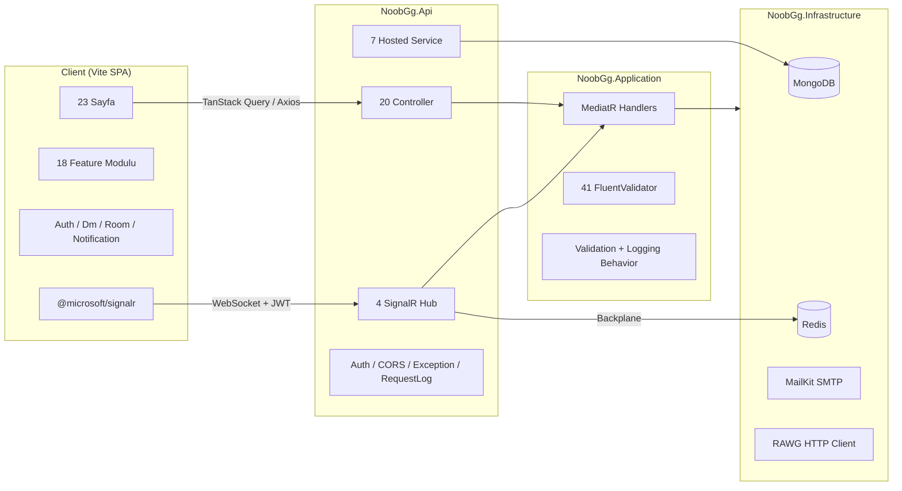
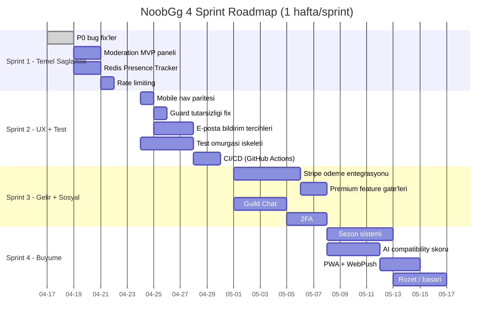
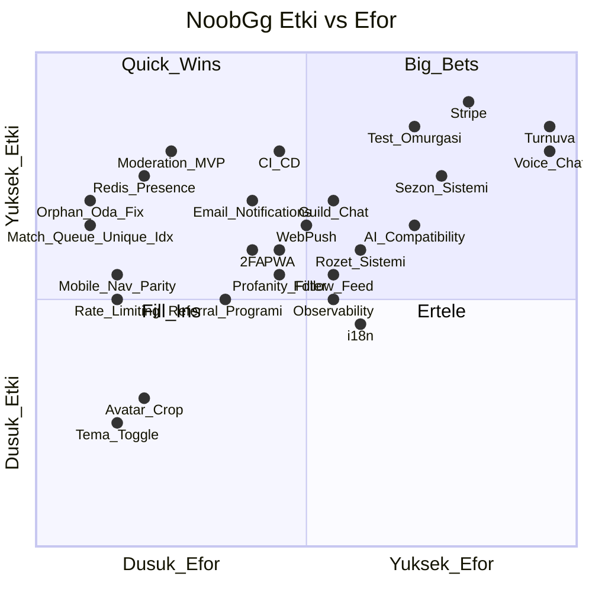

# NoobGg — Analiz ve Gelistirme Onerileri Raporu

**Tarih:** 2026-04-16
**Amac:** NoobGg projesinin mevcut durumunu tek bir kanonik dokumanda toplamak, tespit edilen teknik borc / eksik / tutarsizliklari onceliklendirmek ve **yeni eklenebilecek ozelliklerin yol haritasini** (roadmap) sunmak.
**Kapsam:** Backend (.NET 8 + MongoDB + Redis + SignalR), Frontend (React 19 + Vite 6 + Tailwind v4), dokumantasyon ve test altyapisi.
**Bu rapor neyin yerine gecer?** Mevcut `docs/*.md` ve kokteki `NoobGgProductAnalysisReport.md` dokumanlarini **iptal etmez**, ama yeni eklenen modulleri (Matchmaking, Compare Players, Recent Activity) kapsamayan ve birbirleriyle celisen noktalari duzelten **birlesik kanonik referans** olarak konumlanir.

---

## Icindekiler

1. [Yonetici Ozeti](#1-yonetici-ozeti)
2. [Mevcut Durum Envanteri (Konsolide)](#2-mevcut-durum-envanteri-konsolide)
3. [Rapor Tutarsizliklari ve Kanonik Dokuman Notu](#3-rapor-tutarsizliklari-ve-kanonik-dokuman-notu)
4. [Tespit Edilen Sorunlar / Teknik Borc](#4-tespit-edilen-sorunlar--teknik-borc)
5. [Eklenebilecek Ozellikler (Yeni Roadmap)](#5-eklenebilecek-ozellikler-yeni-roadmap)
    - [5.A Urun Buyumesi](#5a-urun-buyumesi-p0p1)
    - [5.B Sosyal Derinlesme](#5b-sosyal-derinlesme-p1p2)
    - [5.C Oyun ve Rekabet](#5c-oyun-ve-rekabet-p1p2)
    - [5.D Mobil ve Erisilebilirlik](#5d-mobil-ve-erisilebilirlik-p2)
    - [5.E Medya ve Iletisim](#5e-medya-ve-iletisim-p2p3)
    - [5.F Kalite ve Altyapi](#5f-kalite-ve-altyapi-p0p1)
    - [5.G Moderasyon ve Guvenlik](#5g-moderasyon-ve-guvenlik-p1)
    - [5.H Gelir ve Business](#5h-gelir-ve-business-p1p2)
6. [Onerilen Uygulama Sirasi (Sprint Bazli Roadmap)](#6-onerilen-uygulama-sirasi-sprint-bazli-roadmap)
7. [Etki / Efor Matrisi](#7-etki--efor-matrisi)
8. [Ekler](#8-ekler)

---

## 1. Yonetici Ozeti

### Proje Kimligi

| Alan | Deger |
|------|-------|
| Urun | **NoobGg** — oyuncu eslestirme, canli sohbet ve topluluk platformu |
| Backend | .NET 8, MongoDB, Redis, SignalR (Clean Architecture: Domain / Application / Infrastructure / Api) |
| Frontend | React 19, Vite 6, TypeScript, Tailwind v4, TanStack Query, Zustand, Framer Motion |
| Realtime | 4 SignalR hub (`chat`, `room`, `dm`, `notifications`), Redis backplane |
| Olgunluk | **MVP+** — cekirdek tamam, son 2-3 haftada `matchmaking`, `compare`, `recent activity` modulleri eklendi |
| Test kapsami | Cok dusuk (~%1): yalnizca `tests/NoobGg.Application.Tests` altinda 2 dosya |
| Gelir mekanizmasi | Plan / abonelik modeli tanimli, **gercek odeme (Stripe vb.) yok**; `mockPlans` fallback var |

### Kritik Bulgular (3 madde)

1. **Moderasyon paneli bos placeholder** — Backend uc `ModerationController` + `Moderation` feature'lari tam calisirken, `client/src/pages/moderation.tsx` sadece basliktan ibaret. Yetki sistemi `RequireRole(['Moderator','Admin'])` ile kuruldu ama **islev yok**. Bu, mevcut moderator/admin kullanicilar icin **hayalet ozellik**tir.
2. **Matchmaking kuyrugunda orphan oda riski** — `JoinMatchQueueCommandHandler` iki atomik yazim yapiyor (oda + uyeler). Son `LeaveMatchQueue` cagrisi kuyrugu `Cancelled`e cekiyor ancak olusmus **"Quick Match" odasi silinmiyor**. Ayni sekilde DB seviyesinde "kullanici basina tek aktif kuyruk" unique indexi yok.
3. **Uretim odeme altyapisi yok + yaniltici `mockPlans`** — `client/src/pages/subscriptions.tsx` backend plan listesi bos donerse yerli yerinde sahte fiyat ve ozellik gosteriyor. Odeme saglayicisi (Stripe/Iyzico) entegrasyonu **sifir**; `POST /api/subscriptions/assign` sadece admin tarafli.

### En Buyuk 3 Firsat

1. **Moderation MVP + Stripe odeme + E-mail bildirim tercihleri** ucgeni: Backend'in `%80`'i zaten hazir. Frontend tarafinda 3-5 gunluk is + Stripe webhook entegrasyonu ile **hem guven hem gelir** tarafi acilir.
2. **Guild Chat + Sezon sistemi**: Topluluk yapiskanligini artiran iki en etkili ozellik. Mevcut `ChatHub` ve `Elo` altyapisi dogrudan genisletilebilir; yeni Hub eklemek 1-2 gun.
3. **Test omurgasi + CI pipeline**: Urun buyurken regresyon riski artiyor. Vitest + RTL (client), xUnit + Testcontainers (API integration), Playwright e2e ve GitHub Actions workflow'u **3-5 gunluk** tek seferlik yatirim, uzun vadede en cok kazandiracak kalem.

---

## 2. Mevcut Durum Envanteri (Konsolide)

### 2.1 Yuksek Seviye Mimari



### 2.2 Sayfa Matrisi (23 Sayfa)

| Sayfa | Path | Guard | Olgunluk | Ana Bagimliliklar |
|-------|------|-------|----------|-------------------|
| Landing | `/` | Yok | Tam | Yok |
| Login | `/login` | `AuthLayout` | Tam | `auth/hooks` |
| Register | `/register` | `AuthLayout` | Tam | `auth/hooks` |
| Verify Email | `/verify-email` | Yok | Tam | `auth` |
| Onboarding | `/onboarding` | `ProtectedRoute` | Tam | `profile`, `games` |
| Room List | `/rooms` | `ProtectedRoute` + `RequireProfile` | Tam | `rooms`, `matchmaking`, `activity`, `recommendations` |
| Room Detail | `/rooms/:roomId` | Ayni | Tam | `rooms`, `chat` (SignalR), `blocks` |
| Guild List | `/guilds` | Ayni | Tam | `guilds` |
| Guild Detail | `/guilds/:guildId` | Ayni | Iyi | `guilds`, `users discover` |
| Subscriptions | `/subscriptions` | **Sadece AppLayout** | Kismi (mock fallback) | `subscriptions` |
| Leaderboard | `/leaderboard` | **Sadece AppLayout** | Tam | `elo`, `games` |
| Game Detail | `/games/:gameId` | `ProtectedRoute` + `RequireProfile` | Tam | `games` |
| Discover | `/discover` | Ayni | Tam | `users`, `games`, `recommendations` |
| **Compare Players** | `/compare` | Ayni | **Yeni** | `compare/hooks`, `profile`, `elo` |
| Profile | `/profile/:userId` | Ayni | Tam | `profile`, `friends`, `favorites`, `blocks`, `elo` |
| Edit Profile | `/profile/edit` | Ayni | Tam | `profile/schemas` |
| Game Profiles | `/profile/games` | Ayni | Tam | `profile`, `games` |
| Messages | `/messages` | Ayni | Tam | `dm`, `DmProvider` (SignalR), `usePresence`, `activity` |
| Friends | `/friends` | Ayni | Tam | `friends` |
| Favorites | `/favorites` | Ayni | Tam | `favorites` |
| Notifications | `/notifications` | Ayni | Tam | `notifications`, `rooms (invite accept)`, `activity` |
| Settings | `/settings` | Ayni | Kismi ("email/push coming soon") | `settings`, `blocks` |
| **Moderation** | `/moderation` | `RequireRole` | **Placeholder** | Yok |

**Yol:** `client/src/app/router.tsx`

### 2.3 Backend API Yuzeyi (20 Controller, 94+ Endpoint)

| Controller | Rol | Auth | Ornek Endpoint |
|-----------|-----|------|----------------|
| `AuthController` | Kimlik | Kismi | `POST /api/auth/login`, `POST /api/auth/refresh`, `GET /api/auth/me` |
| `HealthController` | Saglik | Anonim | `GET /api/health` |
| `GamesController` | Katalog | Anonim | `GET /api/games`, `/search`, `/{id}` |
| `ProfilesController` | Profil + oyun profili | Kismi | `GET/PUT /api/profiles/me`, `/me/avatar`, `/me/banner` |
| `RoomsController` | Oda + uyelik + davet | Authenticated (liste anonim) | `POST /api/rooms`, `/join`, `/leave`, `/invite/{userId}` |
| `GuildsController` | Lonca yasam dongusu | Authenticated | `/join`, `/leave`, `/kick`, `/role`, `/invite`, `/approve` |
| `FriendsController` | Arkadaslik | Auth | `/request/{userId}`, `/accept`, `/reject` |
| `BlocksController` | Engelleme | Auth | `POST/DELETE /api/blocks/{userId}` |
| `FavoritesController` | Favori | Auth | `POST/DELETE /api/favorites/{userId}` |
| `DirectMessagesController` | DM | Auth | `/conversations/{id}/messages`, `/read` |
| `ChatController` | Oda sohbet gecmisi | Auth | `GET /api/chat/{roomId}/messages` |
| `NotificationsController` | Bildirim feed | Auth | `/unread-count`, `/{id}/read`, `/read-all` |
| `ReportsController` | Kullanici rapor | Auth | `POST /api/reports` |
| `ModerationController` | Rapor inceleme | `RequireModerator` | `GET /api/moderation/reports`, `POST /reports/{id}/review` |
| `RecommendationsController` | Oneri | Auth | `/players`, `/rooms` (limit 1-20) |
| `UsersController` | Kesif + presence + **recent activity** | Kismi | `/discover`, `/presence/batch`, **`/recent-activity`** |
| `EloController` | Puan | Auth + 2 anonim | `/match`, `/leaderboard`, `/history/{userId}/{gameId}` |
| `SettingsController` | Kullanici ayari | Auth | `PUT privacy`, `notifications`, `POST deactivate` |
| `SubscriptionsController` | Plan / abonelik | Kismi | `/plans` (anonim), `/me`, `/assign` (admin), `/cancel` |
| **`MatchmakingController`** | Hizli eslestirme | Auth | `POST/DELETE /api/matchmaking/queue`, `GET /queue/status` |

### 2.4 Realtime (4 SignalR Hub)

| Hub | Path | Sunucu Metotlari | Istemci Event'leri |
|-----|------|------------------|-------------------|
| `ChatHub` | `/hubs/chat` | `JoinRoom`, `LeaveRoom`, `SendMessage`, `StartTyping`, `StopTyping` | `ReceiveMessage`, `UserJoined/Left`, `RoomPresenceUpdated`, `RoomMemberJoined/Left`, `RoomClosed`, typing |
| `RoomHub` | `/hubs/room` | (yalnizca connect/disconnect) | `RoomListUpdated` |
| `DirectMessageHub` | `/hubs/dm` | `JoinConversation`, `SendDirectMessage`, `MarkAsRead`, typing | `ReceiveDirectMessage`, `ConversationUpdated`, `MessagesRead`, `PresenceChanged`, typing |
| `NotificationHub` | `/hubs/notifications` | (connect grubu) | `ReceiveNotification`, `UnreadCountChanged`, `BlockListChanged`, `FriendListChanged`, `ForceDisconnect` |

JWT taninimi hub'larda query `access_token` ile yapiliyor (`src/NoobGg.Api/Extensions/ServiceCollectionExtensions.cs`).

### 2.5 Domain Modeli (28 Entity)

**Hesap/Profil:** `User`, `RefreshToken`, `UserProfile`, `UserGameProfile`, `UserSettings`, `EmailVerificationToken`

**Oyun:** `Game`, `MatchResult`, **`MatchQueueEntry`** *(yeni)*

**Oda/Topluluk:** `Room`, `RoomMember`, `RoomInvite`, `Message`, `Guild`, `GuildMember`, `GuildInvite`, `GuildJoinRequest`

**Sosyal:** `Friendship`, `Favorite`, `Block`, `Notification`, `Conversation`, `DirectMessage`, `Presence`

**Denetim/Gelir:** `Report`, `Audit`, `SubscriptionPlan`, `UserSubscription`

### 2.6 Arka Plan Servisleri (7 Hosted Service)

| Servis | Gorev |
|-------|-------|
| `DatabaseMigrationRunner` | Idempotent Mongo migration'lari |
| `MongoIndexInitializer` | Tum koleksiyon index'leri + **match queue** ozel indexleri |
| `PlanSeedInitializer` | Varsayilan abonelik planlari |
| `FakeDataSeeder` | Dev icin ~1000 kullanici (dolu ise atlar) |
| `EloDataSeeder` | Elo ornek verisi |
| `RoomMemberProfileSeeder` | Eksik oyun profili + oda Elo ortalamasi |
| `GameCatalogSyncJob` | Periyodik RAWG senkronu (ortamda anahtar varsa) |

### 2.7 Son Eklenen Moduller (Degisim Ozeti)

#### A. Matchmaking (Hizli Eslestirme)

- **Entity:** `MatchQueueEntry` (UserId, GameId, Region, Language, EloPoints, Role, Status, MatchedRoomId, ExpiresAt)
- **Enum:** `MatchQueueEntryStatus` (`Searching`, `Matched`, `FallbackSuggested`, `Cancelled`, `Expired`)
- **Application:** `Matchmaking/Commands/{JoinMatchQueue,LeaveMatchQueue}/*` + `Queries/GetMatchQueueStatus/*`
- **Sabitler:** `MatchmakingConstants` → `FallbackAfterSeconds = 45`, `EloTolerancePoints = 400`, `QueueEntryLifetimeMinutes = 15`
- **Controller:** `MatchmakingController` (auth, `api/matchmaking/queue` POST/DELETE, `/status` GET)
- **Client:** `client/src/features/matchmaking/{api,hooks,types}.ts`, `client/src/pages/roomList.tsx` icinde `QuickMatchSection`

#### B. Compare Players

- **Client:** `client/src/features/compare/{hooks,utils,types}.ts` — URL query (`?left=&right=`) ile iki profili yan yana gosterir.
- **Sayfa:** `client/src/pages/comparePlayers.tsx`
- **Backend:** **Yeni endpoint yok** — mevcut `GET /api/profiles/{userId}`, `GET /api/elo/history/...`, `GET /api/users/discover` tekrar kullanildi.

#### C. Recent Activity

- **Endpoint:** `GET /api/users/recent-activity`
- **Application:** `Users/Queries/GetRecentActivity/*` + `DTOs/RecentActivityDtos.cs`
- **Client:** `client/src/features/activity/{api,hooks,types}.ts`, `client/src/components/activity/recentActivitySurfaces.tsx`
- **Kullanim:** Notifications, Messages, Rooms sayfalarinda mini seritler ve `RecentActivityHub`.

---

## 3. Rapor Tutarsizliklari ve Kanonik Dokuman Notu

Projede su anda **5 Markdown dokuman** son durum / roadmap iddiasi tasiyor. Bu raporun olusum gerekcesi, bunlarin birbirleriyle **celisen ifadeler** icermesi ve **yeni modulleri tam kapsamamasi**.

| Dokuman | Guclu Yon | Zayif / Eski Yan |
|---------|-----------|------------------|
| `docs/NoobGg-Proje-Raporu.md` | Recommendation skorlama kurallari + UI cilasi detayli | Matchmaking, Compare, Activity **yok**; Guild/Elo/Matchmaking controller listesi eksik |
| `docs/NoobGg-Musteri-Durum-Raporu.md` | Oncelik matrisi (P0-P3), musteri tonu | Moderation panelinin placeholder oldugu vurgusu haric, son teknik degisiklikler yok |
| `docs/Musteri-Urun-Envanteri-NoobGg.md` | Ozellik "Var/Kismen/Yok" matrisi | Compare ve activity referanslari zayif, PDF iretim notu operasyonel |
| `docs/NoobGg-Kapsamli-Urun-Envanteri.md` | En genis API yuzeyi, 94 endpoint sayilmis | Metinde **23 sayfa**, mermaid diyagramda **22 sayfa** celiskisi |
| `NoobGgProductAnalysisReport.md` | Faz bazli dusunme tarzi | **3 hub** iddiasi (dogrusu 4); bildirim + ayarlar "placeholder" diyor (gercekte islev aktif); Faz 2'de arkadas/favoriler onerisi artik **zaten yapilmis** |

### Baslica Celismeler

1. **Hub sayisi:** `NoobGgProductAnalysisReport.md` **3 hub**; gercek kod 4 hub (`src/NoobGg.Api/Hubs/` + `Program.cs` MapHub cagrilari).
2. **Bildirim sayfasi olgunlugu:** `NoobGgProductAnalysisReport.md` placeholder diyor; gercekte `client/src/pages/notifications.tsx` oda davet accept/decline + `NotificationHub` + `RecentActivityHub` ile **islevsel**.
3. **Arkadaslik / favoriler durumu:** `NoobGgProductAnalysisReport.md` Faz 2 diye oneriyor; gercekte hem controller hem sayfa tam calisiyor.
4. **Sayfa sayisi:** `NoobGg-Kapsamli-Urun-Envanteri.md` icinde **22 vs 23** iki farkli sayim var. Gercek deger: **23** (router.tsx'den sayilan).
5. **Moderasyon paneli durumu:** Tum raporlar "kismi/yok" diyor, gercekten `client/src/pages/moderation.tsx` sadece placeholder. Bu **tek nokta** tum raporlar arasinda uzlasma saglandi.

### Kanonik Dokuman Onerisi

Bu dokuman (`docs/NoobGg-Analiz-ve-Gelistirme-Onerileri.md`), yeni modulleri (matchmaking, compare, recent activity) **dogrulanmis haliyle** icerir ve yukaridaki celismeler icin **dogrulanmis veri** saglar. Oneri: Diger 5 raporun ust kismina sunun basligi veya "arsivlenmistir — guncel surum icin bu dosyaya bakiniz" notu eklenebilir (ayri bir is).

---

## 4. Tespit Edilen Sorunlar / Teknik Borc

Asagidaki tablo, kod taramasi ve alt-ajan analizlerinin birlesiminden uretildi. Her madde: **Oncelik** (P0 = uretim riski, P1 = buyuk UX / DX bozukluk, P2 = iyilesme, P3 = parlatma), **Etki**, **Cozum onerisi** ve **Dosya yolu** icerir.

### 4.1 P0 — Uretim Riski / Kritik

| # | Sorun | Etki | Dosya | Cozum Ozeti |
|---|-------|------|-------|-------------|
| P0-1 | **`/moderation` bos placeholder** | Moderator/admin rolu olan kullanicilar iskeletten bir sey goremez; rapor islem akisi tamamen manuel DB/API. | `client/src/pages/moderation.tsx` | Mevcut `features/moderation/hooks.ts` (var ama baglanmamis) ile rapor listesi + detay + review modal ekle. |
| P0-2 | **`mockPlans` fallback uretimde yaniltici fiyat gosterir** | Kullanici gercek olmayan plana tiklayabilir; musteri guven kaybi. | `client/src/pages/subscriptions.tsx` | Backend bos donerse **uyari tonu**nda "planlar yukleniyor / yok" goster, mock'u dev-only flag arkasina al veya tamamen kaldir. |
| P0-3 | **Matchmaking eslesmesi sonrasi `LeaveMatchQueue` orphan oda birakir** | Kullanici "odadan cikti" ama Quick Match Room DB'de aktif kalir, baska akislari bozar. | `src/NoobGg.Application/Features/Matchmaking/Commands/LeaveMatchQueue/LeaveMatchQueueCommandHandler.cs`, `JoinMatchQueueCommandHandler.cs` | `Matched` durumundaki leave'de: odayi `RoomStatus.Closed` yap, ikinci uyeyi bildir, ikiz kuyruk kaydini `Cancelled`e cek. Atomik transaction veya best-effort compensation. |
| P0-4 | **`InMemoryPresenceTracker` ile multi-instance tutarsizligi** | Yatay olcekleme yapilirsa kullanicinin presence'i hangi node'a dustuyse oradan okunur; diger node'lar `false` doner. | `src/NoobGg.Infrastructure/DependencyInjection.cs`, `IPresenceTracker` implementasyonu | Redis backed implement: key `presence:{userId}`, TTL + heartbeat; pub/sub ile connection event yayinlama. Detay: 5.A.3 |
| P0-5 | **Matchmaking unique constraint yok (race condition)** | Hizli cift POST istegi iki `Searching` kaydi uretebilir, eslesme mantigini bozar. | `src/NoobGg.Api/BackgroundJobs/MongoIndexInitializer.cs` | Partial unique index: `{ UserId: 1 }` filter `{ Status: 'Searching' }` ile. Handler icinde de idempotent upsert. |
| P0-6 | **Guvenlik: `Jwt:Secret` ornekleri `appsettings` uzerinden gelme riski** | README'de uyarilsa da repository'de bir kere bile prod-grade secret yanlislikla eklenirse tum oturumlar etkilenir. | `src/NoobGg.Api/appsettings.json` | Sadece `appsettings.Development.json`'da **dev** secret; prod icin `ASPNETCORE_*` env zorunlu; startup'ta `Jwt:Secret.Length < 32` ise uygulama acilmayacak guard. |

### 4.2 P1 — Buyuk UX / DX Bozukluk

| # | Sorun | Etki | Dosya | Cozum Ozeti |
|---|-------|------|-------|-------------|
| P1-1 | **Mobil alt navigasyon paritesi eksik** | Mobilde `/messages`, `/notifications`, `/friends`, `/favorites`, `/subscriptions` bar'da yok; kullanici URL yazmak zorunda. | `client/src/components/layout/mobileNav.tsx` | 6 -> 10 item'a cikar veya "More" sheet ekle. Alternatif: bottom tab bar + profil menusunde kalan link'ler. |
| P1-2 | **Guard tutarsizligi (`/subscriptions`, `/leaderboard`)** | Oturumsuz kullanici bu iki sayfaya ulasabilir (`ProtectedRoute` + `RequireProfile` yok); icerik orada guard'siz render edilir. | `client/src/app/router.tsx` | Kasitli "herkese acik" ise, sayfa ici "Giris yapmadan katil" flow; degilse `ProtectedRoute` sar. |
| P1-3 | **Matchmaking `status: string`, union degil** | Backend'den gelen beklenmedik string sessizce gecer, UI dallari calismaz. | `client/src/features/matchmaking/types.ts` | Union: `'Idle' \| 'Searching' \| 'FallbackSuggested' \| 'Matched' \| 'Cancelled' \| 'Expired'`; olasilikla `zod` sema + parse. |
| P1-4 | **`DmProvider` toast click'i `window.location.href` kullaniyor** | Tam sayfa yenileme; SignalR bagliligi kopar, state sifirlanir. | `client/src/providers/dmProvider.tsx` | `useNavigate` ile SPA yonlendirme; toast icerisinden `navigate` cagrilabilmesi icin context kapris `createRoot` disindaki toast sistemi ile hizala. |
| P1-5 | **`as any` tip zayifligi** | Rooms/guilds hata mesajlari TypeScript korumasi disinda; refactor regresyon riski. | `client/src/pages/{roomList,guildList,guildDetail}.tsx` | Axios `isAxiosError` + hata gövdesi icin dar tip (`ApiError` interface'i + zod safeParse). |
| P1-6 | **SignalR sessiz catch'leri** | Baglanti sorunlarinda log yok; destek zorlasir. | `client/src/lib/signalr.ts` ve providers | Sentry/console.warn + kullaniciya toast; `onreconnecting` state UI'si. |
| P1-7 | **"Email/push notifications coming soon"** kart yarim | Ayarlar sayfasinda isaretlenmis ama islev yok; kullanicinin email abonelikleri yonetilmiyor. | `client/src/pages/settings.tsx`, `src/NoobGg.Application/Features/Settings/Commands/UpdateNotification/*` | `UserSettings.EmailNotifications` alanlarini genislet + SMTP template + test UI. Detay: 5.A.5 |
| P1-8 | **Discover / presence endpoint'leri anonim + rate limit yok** | Botlar kullanici listesini kazibilir. | `src/NoobGg.Api/Controllers/UsersController.cs` | Nginx/app seviyesinde rate limit (`AspNetCoreRateLimit`), sayfalamayi sert tut, telemetriye ekle. |
| P1-9 | **Test kapsami ~%1** | Her yeni ozellik regresyon uretme riski tasiyor. | `tests/NoobGg.Application.Tests/*` | Vitest + RTL + xUnit + Testcontainers + Playwright cat omurgasi. Detay: 5.F.1 |
| P1-10 | **DM REST + Hub dublikasyonu** | Ayni veri iki yoldan gonderilebilir; validator'lar senkron olmayabilir. | `DirectMessagesController.cs` + `DirectMessageHub.cs` | Hub, REST handler'ini cagirsin (MediatR icinden); validasyon tek yerde. |

### 4.3 P2 — Iyilestirme / Parlatma

| # | Sorun | Etki | Dosya | Cozum Ozeti |
|---|-------|------|-------|-------------|
| P2-1 | i18n eksik | TR/EN karisik metinler (placeholder'lar TR, geri kalan EN) | Cok yerde | `react-i18next` + `public/locales/{tr,en}/*.json`; gradual migrate |
| P2-2 | `react-hooks/exhaustive-deps` disable'lar | Ileride stale closure bug'lari | `client/src/components/chat/chatMessages.tsx`, `client/src/pages/messages.tsx` | Her disable'i tek tek incele, `useCallback`/ref ile cöz |
| P2-3 | `moderation` feature hook'lari UI'de kullanilmiyor | Dead code izlenimi | `client/src/features/moderation/*` | Moderation MVP ile baglayinca cozulur (P0-1) |
| P2-4 | `queryKeys.moderation` tanimli ama tuketilmiyor | Bakım yuku | `client/src/lib/queryKeys.ts` | Ayni — P0-1 icinde cozulur |
| P2-5 | Gercek zamanli guild davet event'i yok | UI manuel refresh gerekir | `GuildInvite` + `NotificationHub` | `NotificationType.GuildInvite` zaten var, dispatch hatti netlestir |
| P2-6 | RoomHub sadece `RoomListUpdated` yayiniliyor | Detayli oda event'leri ChatHub uzerinden; tek sorumluluk ilkesi zayif | `src/NoobGg.Api/Hubs/RoomHub.cs` | RoomHub'a oda kapandi / oda dusuru / uye tip degisti event'lerini tasiyabilir |
| P2-7 | Landing sayfasi SEO meta'si eksik | Organik trafik kayip | `client/src/pages/landing.tsx`, `client/index.html` | `react-helmet-async` + `og:*`, `twitter:card` |
| P2-8 | Swagger sadece Development | Prod'da API kesfi zor (internal tool yok) | `src/NoobGg.Api/Program.cs` | Prod'da `/swagger` basic-auth arkasinda; veya Redoc publish |
| P2-9 | Image dosyalari (avatar/banner) boyut/tip validasyonu zayif | Kotu amacli dosya | `Profiles/Commands/UploadAvatar/*` | Magick.NET / SixLabors ile boyut + icerik tipi dogrulama |
| P2-10 | `OnModelCreating` yok (Mongo) fakat driver seviye `BsonClassMap` dagınik | Yeni field unutulma riski | Entity classlari + `MongoDbContext` | Tek noktada `BsonClassMapRegistrar` |

### 4.4 P3 — Polish

| # | Sorun / Nice-to-have | Dosya |
|---|-------|-------|
| P3-1 | Tema toggle (dark/light) | Tailwind config + `client/src/components/ui` |
| P3-2 | Klavye kisayollari (cmd+k arama, g+r rooms) | `client/src/components/shortcutProvider.tsx` (yeni) |
| P3-3 | Toast kuyruk yonetimi + action button | `client/src/components/ui/toast.tsx` |
| P3-4 | Loading skeleton standardi | Paylasilan `Skeleton` component |
| P3-5 | Onboarding progress indicator | `client/src/pages/onboarding.tsx` |
| P3-6 | Keep-alive (heartbeat) SignalR ayari | hub config |
| P3-7 | Query prefetch page transition | `router.tsx` loader |
| P3-8 | RAWG hata durumunda graceful game search | `GameCatalogSyncJob.cs` |

---

## 5. Eklenebilecek Ozellikler (Yeni Roadmap)

Her oneri icin standart sablon:
- **Ne?** Ozet + kullanici hikayesi
- **Neden?** Degeri / metric hedef
- **Nasil?** Teknik implementasyon notu (entity / endpoint / hub / component)
- **Efor:** S (1-2 gun), M (3-5 gun), L (1-2 hafta), XL (3+ hafta)
- **Oncelik:** P0-P3
- **Bagimliliklar**

---

### 5.A Urun Buyumesi (P0-P1)

#### 5.A.1 Moderasyon MVP Paneli

- **Ne?** `/moderation` sayfasi: rapor listesi (filtre: durum, sebep, tarih), rapor detay modal, review aksiyon (warn / suspend / ban / dismiss). Moderator logu.
- **Neden?** Backend (`ModerationController`) zaten tam; su anda operatorun DB veya Swagger ile calismasi gerekiyor. Bu, en hizli **buyuk kazanc**.
- **Nasil?**
  - Client: `client/src/pages/moderation.tsx` icinde `useReports(filters)`, `useReportDetails(id)`, `useReviewReport()` hook'larini bagla.
  - UI: `DataTable` + `Modal` + `Select/Badge` (mevcut `components/ui`).
  - Yeni componentler: `moderation/ReportCard.tsx`, `moderation/ReviewModal.tsx`.
  - Backend tarafinda ekstra: `GetReportsQuery` icin `pageSize/page`, `orderBy` parametreleri (varsa dokunulmaz).
  - Audit log: her aksiyonda `Audit` entity'sine kayit (`AuditAction.ModerationReview`).
- **Efor:** M (3-5 gun, 1 geliştirici)
- **Oncelik:** P0
- **Bagimliliklar:** Yok (backend hazir)

#### 5.A.2 Guild Chat (Kalici + Realtime)

- **Ne?** Loncalar icin kalici sohbet kanalı. Oda sohbetinden farkli olarak uzun surelidir, uyeye ozel, loncaya ait.
- **Neden?** Guild ozelliği mevcut ama topluluk hissi icin sohbet eksik. `Messages`/Room chat kalibiyla buyuk kopyala-yapistir firsati.
- **Nasil?**
  - Yeni entity: `GuildMessage` (`GuildId`, `UserId`, `Content`, `ReplyToId?`, `EditedAt?`, `DeletedAt?`).
  - Yeni hub: `GuildChatHub` → `/hubs/guild` (JoinGuild, LeaveGuild, SendGuildMessage, Typing).
  - REST: `GET /api/guilds/{id}/messages?before=&pageSize=`, `POST /api/guilds/{id}/messages`.
  - Index: `{ GuildId: 1, CreatedAt: -1 }`, kompoze.
  - Client: mevcut `features/chat/{api,hooks}.ts` kaliplarini `features/guildChat` altina tasi; `guildDetail.tsx` icinde `ChatPanel` reuse.
  - Yetki: yalnizca `GuildMember` ile ayni uyelik.
- **Efor:** M-L (4-7 gun)
- **Oncelik:** P1
- **Bagimliliklar:** Redis SignalR backplane (var)

#### 5.A.3 Redis Presence Tracker

- **Ne?** `IPresenceTracker` arayuzunun Redis backed implementasyonu. Heartbeat-based (30 sn TTL, 15 sn refresh).
- **Neden?** Horizontal scale'de dogru presence; DM'de "cevrimici" rozeti guvenilir olur.
- **Nasil?**
  - Paket: zaten `StackExchange.Redis` var.
  - Implementasyon: `RedisPresenceTracker` → `SET presence:{userId} {connectionId} EX 30` on connect; disconnect'te `DEL`.
  - Heartbeat: `NotificationHub.OnConnectedAsync` sirasinda timer veya connection'da periyodik `SETEX`.
  - Pub/sub: `presence:events` channel; `PresenceChanged` uzerinden tum node'lara broadcast.
  - Anahtar adlandirma (rule: `C:\Users\cevik\.cursor\plugins\cache\cursor-public\redis-development\...\rules\data-key-naming.md`): prefix `NoobGg:presence:user:{userId}`.
  - DI: `services.AddSingleton<IPresenceTracker, RedisPresenceTracker>();` degisimi.
- **Efor:** S-M (2-3 gun)
- **Oncelik:** P0 (prod scale oncesi)
- **Bagimliliklar:** Yok

#### 5.A.4 Stripe Odeme Entegrasyonu

- **Ne?** `SubscriptionPlan` uzerinden gercek odeme; kullanici kendi yukseltebilir, iptal edebilir, fatura gecmisi goruntuler.
- **Neden?** Tek gelir akisi kilitli; admin elle `AssignSubscription` cok manuel.
- **Nasil?**
  - Plan: `plugin-stripe-stripe` MCP + `stripe-best-practices` skill'i kullan.
  - Yeni entity: `StripeCustomer` (UserId → CustomerId mapping), `Invoice` (PaymentIntentId, Amount, Status, PlanId).
  - Controller: `POST /api/subscriptions/checkout-session` (Stripe Checkout URL doner), `POST /api/subscriptions/webhook` (Stripe event'leri).
  - Webhook olaylari: `checkout.session.completed`, `invoice.paid`, `customer.subscription.deleted`.
  - Idempotency: event id MongoDB'de upsert ile kontrol.
  - Client: `subscriptions.tsx`'ya "Upgrade" butonu → Checkout redirect; `/subscriptions/success?session_id=` callback.
  - Test: Stripe CLI ile webhook dinleme + dev plan oluşturma.
- **Efor:** L (7-10 gun + QA)
- **Oncelik:** P1
- **Bagimliliklar:** Stripe account, webhook endpoint secret

#### 5.A.5 E-posta Bildirim Tercihleri ve Gonderimi

- **Ne?** Kullanici ayari: hangi bildirim turu e-mail ile gonderilsin (arkadas isteği, yeni DM, oda daveti, lonca daveti, sistem).
- **Neden?** Ayarlar sayfasinda "coming soon" notu var; uygulama dışına degerli temas noktalari acilmaz.
- **Nasil?**
  - Entity genisletme: `UserSettings.EmailNotifications` (bool flag'ler veya `Dictionary<NotificationType,bool>`).
  - Backend servis: `IEmailNotificationDispatcher` — `NotificationCreated` event'inde tercihe bakip `MailKit` uzerinden yollar.
  - Template: `EmailTemplates/FriendRequest.html`, `Dm.html` vb. (Handlebars.NET veya Razor).
  - Background job: `EmailQueueWorker` — basarisiz gonderimler icin retry.
  - Client: `settings.tsx` "Email notifications" kart — toggle'lar + test mail butonu.
- **Efor:** M (3-5 gun)
- **Oncelik:** P1
- **Bagimliliklar:** SMTP config (var)

---

### 5.B Sosyal Derinlesme (P1-P2)

#### 5.B.1 DM Arama ve Arsiv

- **Ne?** `/messages` icinde arama cubugu; konusma adlarinda + son mesaj icerik substringinde arama.
- **Neden?** Mesaj birikince bulunmasi zor.
- **Nasil?**
  - Backend: `GET /api/dm/conversations/search?q=`
  - Index: `DirectMessages.Content` icin MongoDB text index (dikkat: biyutu sisman)
  - Alternatif: son 30 gunluk mesajlarda `$regex` (hizli prototip)
  - Client: `MessagesPage` icinde `SearchBar` component; debounce 300ms.
- **Efor:** S-M (2-3 gun)
- **Oncelik:** P2

#### 5.B.2 Oda Spectator Modu

- **Ne?** Odaya "katilmadan" sohbet okuyabilme. Tek yönlu; yazamaz.
- **Neden?** Discover'dan rastgele tiklayan kullanici deneyimini azaltir.
- **Nasil?**
  - `Room.AllowSpectators` bool + `RoomMemberRole.Spectator` enum degeri.
  - Client: `roomDetail.tsx` icinde, uye degilse "Spectate" butonu; mesaj input disabled.
  - Yetki: `ChatHub.SendMessage` server tarafi `Spectator` ise 403.
- **Efor:** M (3-4 gun)
- **Oncelik:** P2

#### 5.B.3 Sosyal Feed (Following)

- **Ne?** Kullanici takip ettigi oyunculara gore akis: yeni oda, yeni basari, online geldi.
- **Neden?** Recent Activity aktif; takip iliskisi ekleyerek "feed" kavramini surdurulebilir hale getirmek.
- **Nasil?**
  - Yeni entity: `Follow` (`FollowerId`, `FollowingId`, `CreatedAt`).
  - Query: `GetFollowingFeedQuery` — son 7 gun aktiviteyi birlestirir.
  - Client: `/discover?tab=feed` veya ayri `/feed` sayfa.
- **Efor:** M-L (4-6 gun)
- **Oncelik:** P2
- **Bagimliliklar:** Friendship'den ayri "one-way" follow modeli

#### 5.B.4 Rozet / Basari (Achievements) Sistemi

- **Ne?** Sunucu tarafli rozetler: "Ilk maç", "100 maç", "İlk arkadas", "10 oda olusturdu".
- **Neden?** Gamification — retention artirir.
- **Nasil?**
  - Entity: `Badge` (metadata), `UserBadge` (iliski).
  - Event-driven: `MatchRecorded`, `FriendshipAccepted` vb. MediatR notification'lari uzerinden `BadgeEvaluator` calisir.
  - Client: profil sayfasinda "Achievements" sekmesi.
  - Unlockable animation (Framer Motion).
- **Efor:** L (5-8 gun)
- **Oncelik:** P2

#### 5.B.5 Referans Programi

- **Ne?** Kullanici bir referans linki alir (`?ref=userId`); kayit + dogrulama sonrasi her iki tarafa "Premium 1 hafta" veya badge odul.
- **Neden?** Viral buyume.
- **Nasil?**
  - `AuthController.Register` icinde `ref` query parametresi; yeni entity `Referral` (`ReferrerId`, `RefereeId`, `CreatedAt`, `ConvertedAt`).
  - `SubscriptionService.GrantTemporary(userId, days, tier)`.
- **Efor:** M (3-5 gun)
- **Oncelik:** P2

#### 5.B.6 Profil Showcase

- **Ne?** "Favori 3 oyun" pinleme, profil bannerinda kucuk Elo grafigi, ozel quotes.
- **Neden?** Profil ozgunlugu.
- **Nasil?**
  - `UserProfile.PinnedGameIds` (max 3), `UserProfile.Bio` mevcut uzatma.
  - Client: `editProfile.tsx` pin/unpin UI; `profile.tsx` showcase bolumu.
- **Efor:** S (1-2 gun)
- **Oncelik:** P2

---

### 5.C Oyun ve Rekabet (P1-P2)

#### 5.C.1 Sezon Sistemi

- **Ne?** Her N (ornegin 3 ay) sezonda Elo reset (soft), sezon sonunda odul rozet + plan uzatmasi.
- **Neden?** "Yeniden baslama" duygusu, surekli engagement dongusu.
- **Nasil?**
  - Entity: `Season` (`GameId`, `StartsAt`, `EndsAt`, `Name`, `RewardsJson`).
  - `UserGameProfile` icinde `CurrentSeasonElo` + `AllTimeElo` ayrimi.
  - Background job: `SeasonRolloverJob` — bitim saatinde snapshot + reset.
  - Client: leaderboard'ta sezon secici.
- **Efor:** L (7-10 gun)
- **Oncelik:** P1

#### 5.C.2 Turnuva ve Lig

- **Ne?** Kullanicilarin olusturabildigi turnuva: bracket (single/double elimination), round-robin; maclar oda olarak acilir.
- **Neden?** Cekirdek rekabet ozelligi; guild'lere binebilir.
- **Nasil?**
  - Entity: `Tournament`, `TournamentParticipant`, `TournamentMatch`.
  - Bracket engine (kutuphane: `Challonge.NET` veya kendi: tam eksiltme icin `2^n` bracket klasik algoritma).
  - SignalR event: `TournamentMatchReady` → kullaniciya davet.
  - Client: `/tournaments` sayfasi, liste + create wizard.
- **Efor:** XL (2-3 hafta)
- **Oncelik:** P2

#### 5.C.3 Detayli Match Analitigi

- **Ne?** Maç sonu ekraninda: Elo delta, ortalama rakip Elo, MVP olarak isaretlenme sayilari, son 10 maçlik trend.
- **Neden?** Rekabet kullanicilarinda kaliteyi artirir.
- **Nasil?**
  - `MatchResult` zaten var; query: `GetMatchDetailsQuery`.
  - Client: mevcut `LeaderboardPage` `RecordMatchModal`'a daha zengin ekran ekle.
- **Efor:** M (3-5 gun)
- **Oncelik:** P2

#### 5.C.4 AI Tabanli Oneri (Vercel AI Gateway)

- **Ne?** "Sizinle en iyi eslesecek oyuncular" icin LLM tabanli skor. Mevcut kural tabanlisina ek olarak.
- **Neden?** Uzun kuyrukta klasik kurallar yetmedigi durumda ek sinyal.
- **Nasil?**
  - Vercel AI Gateway MCP + `ai-sdk` skill'i.
  - Sunucu tarafinda: `ICompatibilityAiService` → oyuncu profilleri embed'i + cosine benzerlik, veya Gemini/GPT cagrisi.
  - Cache: Redis 24 saat.
  - Rate limit: kullanici basina gunde 20 istek.
- **Efor:** L (5-8 gun)
- **Oncelik:** P2
- **Bagimliliklar:** AI gateway aboneligi

#### 5.C.5 LFT v2 Akilli Eslestirme

- **Ne?** Mevcut kural tabanlisina ek: saat dilimi yakinligi, son 7 gun aktiflik, ping/latency proxy.
- **Neden?** Daha kaliteli eslesme → retention.
- **Nasil?**
  - `DiscoverPlayersQuery` icine `timezoneAffinityScore`, `activityScore` eklemeleri.
  - Sabit agirliklar yerine A/B test kontrollu `MatchmakingScoringOptions`.
- **Efor:** M (3-5 gun)
- **Oncelik:** P2

---

### 5.D Mobil ve Erisilebilirlik (P2)

#### 5.D.1 PWA (Progressive Web App)

- **Ne?** `manifest.json`, service worker, "Ana ekrana ekle" davet.
- **Neden?** Mobilde native uygulama hissi; push bildirimi temeli.
- **Nasil?**
  - Vite plugin: `vite-plugin-pwa`.
  - SW: TanStack Query persistence (IndexedDB) + asset precache.
  - Offline fallback: `/offline` sayfasi.
- **Efor:** M (3-4 gun)
- **Oncelik:** P2

#### 5.D.2 WebPush Bildirimleri

- **Ne?** Tarayici push bildirimleri: yeni DM, oda daveti, lonca daveti.
- **Neden?** App disinda etkilesim.
- **Nasil?**
  - Client: `Notification.requestPermission()` + `PushSubscription` registration.
  - Backend: `IWebPushDispatcher` (Lib.Net.Http.WebPush veya `WebPush` NuGet).
  - VAPID anahtarlari env'den.
  - `NotificationHub.ReceiveNotification` event'i baska kanallara da (push) yansimali.
- **Efor:** M (3-5 gun)
- **Oncelik:** P2
- **Bagimliliklar:** VAPID key, PWA

#### 5.D.3 Klavye Kisayollari + Cmd+K Palet

- **Ne?** `cmd+k` → global arama palet; `g r` → rooms; `g m` → messages gibi Superhuman tarzi navigasyon.
- **Neden?** Power user'lar icin verimlilik. 
- **Nasil?**
  - Paket: `cmdk` React kutuphanesi.
  - `ShortcutProvider` context, `useHotkey(keys, handler)`.
  - Arama endpoint: `GET /api/search?q=` (kullanici + oda + oyun + lonca birlesik).
- **Efor:** M (3-4 gun)
- **Oncelik:** P3

#### 5.D.4 Dark/Light Tema Toggle

- **Ne?** Kullanici tema secer. Sistem tercihine de otomatik uyum.
- **Neden?** Su an Tailwind dark odakli; acik tema isteyen kullanici kosulu var.
- **Nasil?**
  - `class="dark"` toggle + `UserSettings.Theme`.
  - Tailwind v4 `@media (prefers-color-scheme)` + manual override.
- **Efor:** S (1-2 gun)
- **Oncelik:** P3

---

### 5.E Medya ve Iletisim (P2-P3)

#### 5.E.1 Sesli Oda (Voice Chat)

- **Ne?** Oda uyeleri arasinda WebRTC tabanli voice cat; push-to-talk + serbest modu.
- **Neden?** Gaming platformu icin kritik ozellik.
- **Nasil?**
  - SFU (selective forwarding unit) tercih: LiveKit veya Daily.co (SaaS).
  - Backend: `POST /api/rooms/{id}/voice/token` → LiveKit JWT doner.
  - Client: `@livekit/components-react`.
  - Premium gating: free tier 15 dk/gun, premium sinirsiz.
- **Efor:** XL (2+ hafta)
- **Oncelik:** P2
- **Bagimliliklar:** LiveKit hesabi (~$0.004/dk/participant)

#### 5.E.2 Ekran Paylasimi

- **Ne?** Oda icinde screen share — oyun aninda ayri yayin / izleme.
- **Neden?** Konsept yardim / streaming.
- **Nasil?**
  - Ayni SFU (5.E.1) ile.
  - `getDisplayMedia()` API.
- **Efor:** L
- **Oncelik:** P3
- **Bagimliliklar:** 5.E.1

#### 5.E.3 Avatar Crop / Editor

- **Ne?** Avatar yuklerken inline crop + rotate.
- **Neden?** UX; kullanicinin resmini tekrar tekrar redimensionlamasini engeller.
- **Nasil?**
  - `react-easy-crop` client component.
  - Ciktiyi canvas → PNG blob → mevcut `POST /api/profiles/me/avatar` endpoint'ine yolla.
- **Efor:** S (1-2 gun)
- **Oncelik:** P2

#### 5.E.4 Zengin Sohbet (Mentions, Emoji, Reactions)

- **Ne?** `@kullanici`, `:emoji:`, mesaja emoji reaction.
- **Neden?** Mesajlasma kalitesi.
- **Nasil?**
  - Client: `@` tipinde oyuncu arama dropdown (`useDiscoverPlayers`).
  - Emoji picker: `emoji-mart`.
  - Reaction: yeni entity `MessageReaction` + hub broadcast.
- **Efor:** M (3-5 gun)
- **Oncelik:** P2

---

### 5.F Kalite ve Altyapi (P0-P1)

#### 5.F.1 Test Omurgasi

**En buyuk tek yatirim.**

- **Client (Vitest + RTL):**
  - `npm i -D vitest @testing-library/react @testing-library/jest-dom jsdom`
  - `client/vitest.config.ts` + setup dosyasi.
  - Basta kritik komponentlerden baslar: `ProtectedRoute`, `RequireProfile`, `roomList QuickMatchSection`, `comparePlayers buildCompareViewModel`.
  - Minimum hedef: %40 coverage ilk sprintte.
- **API integration (xUnit + Testcontainers):**
  - `tests/NoobGg.Api.IntegrationTests` projesi.
  - `Testcontainers.MongoDb` + `Testcontainers.Redis`.
  - `WebApplicationFactory<Program>` ile e2e HTTP.
  - Ornek: `POST /api/matchmaking/queue` + status polling e2e.
- **E2E (Playwright):**
  - `playwright.config.ts` + `e2e/` klasoru.
  - Senaryolar: login, room create + join, send DM, matchmaking queue, compare view.
  - MCP: `user-playwright` mevcut.
- **Efor:** L (7-10 gun setup + ilk 20-30 test)
- **Oncelik:** P0

#### 5.F.2 CI/CD (GitHub Actions)

- **Ne?** PR'da lint + test + dotnet build; main push'ta docker build.
- **Neden?** Regresyon disiplini.
- **Nasil?**
  - `.github/workflows/ci.yml` — 3 job: `client-lint-test`, `api-build-test`, `e2e`.
  - PR preview: Vercel veya fly.io; backend preview icin Docker image push.
- **Efor:** M (3-5 gun)
- **Oncelik:** P0

#### 5.F.3 Observability (OpenTelemetry + Seq)

- **Ne?** Dagitik izleme + log aggregator.
- **Neden?** Prod'da incident root cause.
- **Nasil?**
  - Paket: `OpenTelemetry.Extensions.Hosting`, `.Exporter.Otlp`.
  - Instrumentation: ASP.NET, HttpClient, MongoDB, Redis.
  - Sink: Seq (self-host Docker) veya Grafana Cloud.
  - Serilog `WriteTo.OpenTelemetry` ile log → trace correlation.
- **Efor:** M (3-5 gun)
- **Oncelik:** P1

#### 5.F.4 Rate Limiting

- **Ne?** IP + kullanici bazli istek sayisi sinirlamasi.
- **Neden?** DoS + scraping engelleme.
- **Nasil?**
  - .NET 8 built-in `RateLimiter` middleware:
    ```csharp
    builder.Services.AddRateLimiter(opt => { /* fixed window per user */ });
    ```
  - Policies: `discover` icin 60 istek/dk, `auth` icin 10 istek/dk, default 300 istek/dk.
- **Efor:** S (1-2 gun)
- **Oncelik:** P1

#### 5.F.5 i18n Altyapisi (react-i18next)

- **Ne?** TR/EN + gelecek diller icin cevirileri donanimli yonetim.
- **Neden?** Musteri tabani cesitli; su anda karisik metinler.
- **Nasil?**
  - `npm i i18next react-i18next i18next-browser-languagedetector`.
  - `public/locales/{tr,en}/common.json`, `auth.json`, `rooms.json`.
  - Hook: `useTranslation('rooms')`.
  - Script: mevcut hardcoded stringleri tarayip key'e cevirecek codemod.
- **Efor:** M-L (5-7 gun ilk migrate)
- **Oncelik:** P2

#### 5.F.6 `docker-compose.prod.yml`

- **Ne?** Uretim-like compose: TLS, secret management, healthcheck, resource limits.
- **Neden?** Su anda sadece dev compose.
- **Nasil?**
  - `docker-compose.prod.yml` + `.env.prod.example`.
  - nginx reverse proxy + Let's Encrypt (Caddy alternatif).
  - MongoDB replica set (single node) + auth.
- **Efor:** M (3-5 gun)
- **Oncelik:** P1

---

### 5.G Moderasyon ve Guvenlik (P1)

#### 5.G.1 Otomatik Kotu Soz Filtresi

- **Ne?** DM ve chat mesajlarinda kufur/spam otomatik tespit + uyari + moderator kuyrugu.
- **Neden?** Topluluk saglıgı.
- **Nasil?**
  - `BetterProfanity.Net` NuGet (basit) veya `IProfanityFilter` interface + Azure Content Safety/OpenAI Moderation API (gelismis).
  - `ChatHub.SendMessage` + `DirectMessageHub.SendDirectMessage` once filtreye sokar.
  - Esik asimi: otomatik `Report` uret, kullaniciya toast "mesajiniz incelemeye alinmistir".
- **Efor:** M (3-5 gun)
- **Oncelik:** P1

#### 5.G.2 Rapor Iki-Asamali Aksiyon Akisi

- **Ne?** Moderator aksiyonlari: `Warn` → `Suspend 24h/7d` → `Ban`.
- **Neden?** Su anda kullanici kara listeye tek tiklama — orantili degil.
- **Nasil?**
  - `UserModerationStatus` enum: `None`, `Warned`, `Suspended`, `Banned`.
  - `UserSuspension` entity (`UserId`, `ReviewId`, `Until`, `Reason`).
  - `AuthController.Login` suspension kontrolu.
- **Efor:** M (3-5 gun)
- **Oncelik:** P1
- **Bagimliliklar:** 5.A.1 (moderation MVP)

#### 5.G.3 Audit Log UI

- **Ne?** Admin icin `/admin/audit` — `Audit` entity'leri listeler, filtre: kullanici, aksiyon, tarih.
- **Neden?** `Audit` uretiliyor ama gorunmuyor.
- **Nasil?**
  - Controller: `GET /api/admin/audit?userId=&action=&from=&to=`.
  - Client: yeni sayfa `/admin/audit` — `RequireRole(['Admin'])`.
- **Efor:** S-M (2-4 gun)
- **Oncelik:** P2

#### 5.G.4 2FA (TOTP)

- **Ne?** Iki asamali dogrulama — Google Authenticator uyumlu TOTP + backup kodlari.
- **Neden?** Hesap guvenligi.
- **Nasil?**
  - Paket: `OtpNet` NuGet.
  - Entity: `UserTwoFactor` (`Secret`, `BackupCodes`, `EnabledAt`).
  - Endpoint: `POST /api/auth/2fa/setup` (QR URL), `POST /api/auth/2fa/verify` (code), `POST /api/auth/login` icine `totp` parametresi.
  - Client: `settings.tsx` "Security" sekmesi.
- **Efor:** M (3-5 gun)
- **Oncelik:** P1

#### 5.G.5 CAPTCHA (Register/Login)

- **Ne?** Bot kaydini engellemek icin Cloudflare Turnstile veya hCaptcha.
- **Neden?** Fake account'lar ozellikle fake data seeder'a karisabilir; uretimde real risk.
- **Nasil?**
  - Client: `<Turnstile siteKey={...} onVerify={token => ...}/>`.
  - Backend: `POST /api/auth/register` body'sine `captchaToken` + sunucu dogrulamasi.
- **Efor:** S (1-2 gun)
- **Oncelik:** P1

---

### 5.H Gelir ve Business (P1-P2)

#### 5.H.1 Premium Ozellik Kapilari

- **Ne?** `UserSubscription.Tier` bazinda kilitli ozellikler:
  - `Free`: bildirimler, temel discover.
  - `Plus`: 5 pin, profil showcase, reklamsiz.
  - `Pro`: +voice sinirsiz, oda slot 10, ozel rozet.
- **Neden?** Free/paid ayrimi monetization icin sart.
- **Nasil?**
  - `ISubscriptionGate.Can(userId, Feature)` servisi — handler'larda cagirilir.
  - Client: `<FeatureGate feature="VoiceUnlimited">...<Upgrade/></FeatureGate>`.
- **Efor:** M (3-5 gun)
- **Oncelik:** P1
- **Bagimliliklar:** 5.A.4 (Stripe)

#### 5.H.2 Free Tier Reklam Banner

- **Ne?** Free kullanicilar icin sayfa basi 1 reklam (Google AdSense veya kendi 1st party).
- **Neden?** Free kullaniciyi monetize etme.
- **Nasil?**
  - `<AdSlot position="discover-top"/>` component; `UserSubscription.Tier == Free` ise render.
  - AdSense script'i `index.html`'de conditional.
- **Efor:** S-M (2-3 gun)
- **Oncelik:** P3

#### 5.H.3 "Boost Profile"

- **Ne?** Kisa sureli (24 saat) discover siralamasinda yukseltme. Para/XP karsiligi.
- **Neden?** Mikro-monetization.
- **Nasil?**
  - Entity: `ProfileBoost` (`UserId`, `ExpiresAt`).
  - `DiscoverPlayersQuery` icinde boosted kullanicilar yukseliyor (sinirli).
  - Client: `/profile/edit` "Boost" butonu.
- **Efor:** S (1-2 gun)
- **Oncelik:** P2

#### 5.H.4 Hediye Abonelik

- **Ne?** Arkadasa 1 aylik premium hediye gonderme.
- **Neden?** Arkadasliktan kaynakli buyume.
- **Nasil?**
  - Stripe `mode=payment` + `metadata.giftedToUserId`; webhook'ta otomatik abonelik acilir.
- **Efor:** S (1-2 gun, 5.A.4 sonrasi)
- **Oncelik:** P3

---

## 6. Onerilen Uygulama Sirasi (Sprint Bazli Roadmap)

Asagidaki sprint'ler **ardisik** degil; ekibe ve kaynaklara gore paralel yurutulebilir. Her sprint ~1 hafta (1-2 kisilik tam-zamanli ekip).



### Sprint 1 — Temel Saglamlik (P0 odakli)

| Madde | Oncelik | Efor | Tanim |
|-------|---------|------|-------|
| P0-1 Moderation MVP | P0 | M | 5.A.1 detayi |
| P0-3 Matchmaking orphan oda fix | P0 | S | LeaveMatchQueue handler duzeltmesi |
| P0-4 Redis Presence | P0 | S-M | 5.A.3 |
| P0-5 Match queue unique index | P0 | S | `MongoIndexInitializer` + handler idempotency |
| P0-2 Subscriptions mock fallback temizligi | P0 | S | UI uyari state + dev-only |
| P0-6 Jwt secret guvenligi | P0 | S | Startup guard + README uyarisi |

**Cikti:** Uretime guven. Iskeleti atilmis moderation paneli.
**Risk:** Moderation UI'nin tam plana uyup uymayacagi.

### Sprint 2 — UX Hizlanma + Test Altyapisi

| Madde | Oncelik | Efor |
|-------|---------|------|
| P1-1 Mobile nav | P1 | S |
| P1-2 Guard tutarsizligi | P1 | S |
| P1-3 Matchmaking types union | P1 | S |
| P1-7 E-posta bildirim tercihleri | P1 | M |
| 5.F.1 Test omurgasi iskelet (Vitest + xUnit + Playwright kiblesi) | P0 | L |
| 5.F.2 GitHub Actions CI | P0 | M |
| P1-8 Rate limiting | P1 | S |

**Cikti:** Yeni ozelliklerin regresyonsuz akmasi. 20+ test. CI yesili.

### Sprint 3 — Gelir + Sosyal Derinlesme

| Madde | Oncelik | Efor |
|-------|---------|------|
| 5.A.4 Stripe entegrasyonu | P1 | L |
| 5.H.1 Premium feature gate'leri | P1 | M |
| 5.A.2 Guild Chat | P1 | M-L |
| 5.G.4 2FA | P1 | M |
| P2-1 i18n altyapisi ilk migrate | P2 | M |

**Cikti:** Gercek odeme akisi canli. Guild'larda sohbet. Guvenlik +.

### Sprint 4 — Buyume ve Engagement

| Madde | Oncelik | Efor |
|-------|---------|------|
| 5.C.1 Sezon sistemi | P1 | L |
| 5.C.4 AI compatibility skoru | P2 | L |
| 5.D.1 PWA + 5.D.2 WebPush | P2 | M |
| 5.B.4 Rozet / basari | P2 | L |
| 5.G.1 Profanity filter | P1 | M |

**Cikti:** Retention dongusu, mobilde native hissi, otomatik moderasyon.

### Sprint 5+ (Opsiyonel / Vizyon)

- 5.C.2 Turnuva sistemi (XL)
- 5.E.1 Voice chat (XL)
- 5.B.3 Sosyal feed
- 5.E.4 Zengin sohbet
- 5.F.3 Observability
- 5.H.3 Boost profile
- 5.B.5 Referans programi

---

## 7. Etki / Efor Matrisi

Quadrant: eksen 1 = **Etki** (Dusuk → Yuksek), eksen 2 = **Efor** (Dusuk → Yuksek). **Sol ust = quick wins**, **Sag ust = big bets**, **Sol alt = fill-ins**, **Sag alt = ertele**.



**Quick Wins** (hemen yapilir):
- Orphan oda fix, match queue unique index, mobile nav parity, rate limiting, avatar crop, tema toggle, guard tutarsizligi

**Big Bets** (stratejik):
- Test omurgasi + CI, Stripe, sezon sistemi, AI compatibility, turnuva, voice chat

**Fill-Ins** (bos saatlerde):
- Referral programi, i18n migrate, observability

**Erteleme onerileri:**
- Ekran paylasimi (5.E.2) — voice chat olmadan anlamsiz
- Hediye abonelik — Stripe temelinden sonra

---

## 8. Ekler

### Ek A. Mevcut Dokumanlarin Kisa Karsilastirmasi

| Dokuman | Son Guncel Modul | Roadmap Var mi? | Yeni Modul Kapsami |
|---------|------------------|-----------------|--------------------|
| `docs/NoobGg-Proje-Raporu.md` | Recommendations | Hayir (bilincli) | Matchmaking/Compare/Activity yok |
| `docs/NoobGg-Musteri-Durum-Raporu.md` | MVP+ tanim | P0-P3 matrisi var | Matchmaking deginilmis ama derin degil |
| `docs/Musteri-Urun-Envanteri-NoobGg.md` | Oniki feature listesi | Sinirli | Compare sayfa olarak listelenmis |
| `docs/NoobGg-Kapsamli-Urun-Envanteri.md` | 94 endpoint, 23 sayfa | Acik eksikler | En genis ama mermaid celismesi var |
| `NoobGgProductAnalysisReport.md` | Faz 1-2 | Var ama eski | Yeni modulleri kapsamiyor |
| **`docs/NoobGg-Analiz-ve-Gelistirme-Onerileri.md`** (bu) | 2026-04 tum | Tam roadmap | Matchmaking/Compare/Activity dahil |

### Ek B. Kullanilacak MCP ve Skill'ler

Projede kullanilabilecek zaten yuklu MCP sunuculari:

| MCP | Skill / Aktiviteler | Rapor icinde |
|-----|---------------------|--------------|
| `plugin-stripe-stripe` | `stripe-best-practices`, `upgrade-stripe` | 5.A.4 |
| `plugin-vercel-vercel` | `ai-sdk`, `ai-gateway`, `deployments-cicd`, `env-vars` | 5.C.4, 5.F.2 |
| `plugin-convex-convex` | `schema-design`, `function-creator` (ileride backend alternatif) | Opsiyonel |
| `plugin-figma-figma` | `figma-implement-design` | UI tasarimi |
| `plugin-slack-slack` | Bildirim kanali | Internal |
| `plugin-notion-workspace-notion` | `create-task`, `spec-to-implementation` | Proje yonetimi |
| `user-playwright` | e2e test yazimi | 5.F.1 |
| `user-context7` | Framework dokumantasyonu | Genel |
| `user-@21st-dev/magic` | UI bilesen iskeleti | 5.B.4 rozet kartlari |

### Ek C. Ornek Snippet'ler

#### C.1 Match Queue Unique Partial Index (MongoDB)

```csharp
// src/NoobGg.Api/BackgroundJobs/MongoIndexInitializer.cs
var matchQueueCollection = database.GetCollection<MatchQueueEntry>("matchQueueEntries");

var activeQueueIndex = Builders<MatchQueueEntry>.IndexKeys
    .Ascending(x => x.UserId);

var activeQueueOptions = new CreateIndexOptions<MatchQueueEntry>
{
    Name = "uniq_userId_active_queue",
    Unique = true,
    PartialFilterExpression = Builders<MatchQueueEntry>.Filter.Eq(x => x.Status, MatchQueueEntryStatus.Searching)
};

await matchQueueCollection.Indexes.CreateOneAsync(
    new CreateIndexModel<MatchQueueEntry>(activeQueueIndex, activeQueueOptions),
    cancellationToken: ct);
```

#### C.2 Redis Presence Tracker Iskeleti

```csharp
public sealed class RedisPresenceTracker(IConnectionMultiplexer redis) : IPresenceTracker
{
    private static readonly TimeSpan Ttl = TimeSpan.FromSeconds(30);
    private static string Key(Guid userId) => $"NoobGg:presence:user:{userId:N}";

    public async Task MarkOnlineAsync(Guid userId, string connectionId, CancellationToken ct)
    {
        var db = redis.GetDatabase();
        await db.StringSetAsync(Key(userId), connectionId, Ttl);
        await redis.GetSubscriber().PublishAsync(
            RedisChannel.Literal("NoobGg:presence:events"),
            $"{userId}:online");
    }

    public async Task<bool> IsOnlineAsync(Guid userId, CancellationToken ct)
    {
        var db = redis.GetDatabase();
        return await db.KeyExistsAsync(Key(userId));
    }

    public async Task RefreshAsync(Guid userId, CancellationToken ct)
    {
        var db = redis.GetDatabase();
        await db.KeyExpireAsync(Key(userId), Ttl);
    }
}
```

#### C.3 Matchmaking Types Union (TypeScript)

```typescript
// client/src/features/matchmaking/types.ts
export const MATCH_QUEUE_STATUSES = [
  'Idle',
  'Searching',
  'FallbackSuggested',
  'Matched',
  'Cancelled',
  'Expired',
] as const;

export type MatchQueueStatus = typeof MATCH_QUEUE_STATUSES[number];

export interface GetMatchQueueStatusResponse {
  status: MatchQueueStatus;
  matchedRoomId?: string;
  fallbackReady: boolean;
  gameId?: string;
  secondsInQueue: number;
}
```

#### C.4 GitHub Actions CI Iskeleti

```yaml
# .github/workflows/ci.yml
name: CI
on:
  push: { branches: [main] }
  pull_request: { branches: [main] }

jobs:
  client:
    runs-on: ubuntu-latest
    defaults: { run: { working-directory: client } }
    steps:
      - uses: actions/checkout@v4
      - uses: actions/setup-node@v4
        with: { node-version: '20', cache: 'npm', cache-dependency-path: client/package-lock.json }
      - run: npm ci
      - run: npm run lint
      - run: npm run build

  api:
    runs-on: ubuntu-latest
    steps:
      - uses: actions/checkout@v4
      - uses: actions/setup-dotnet@v4
        with: { dotnet-version: '8.0.x' }
      - run: dotnet restore NoobGg.sln
      - run: dotnet build NoobGg.sln --no-restore -c Release
      - run: dotnet test NoobGg.sln --no-build -c Release --logger trx --results-directory TestResults
      - uses: actions/upload-artifact@v4
        if: always()
        with: { name: test-results, path: TestResults }
```

#### C.5 Rate Limiting Policy (ASP.NET 8)

```csharp
// src/NoobGg.Api/Program.cs
builder.Services.AddRateLimiter(options =>
{
    options.RejectionStatusCode = StatusCodes.Status429TooManyRequests;

    options.AddPolicy("auth", context =>
        RateLimitPartition.GetFixedWindowLimiter(
            partitionKey: context.Connection.RemoteIpAddress?.ToString() ?? "anon",
            factory: _ => new FixedWindowRateLimiterOptions
            {
                PermitLimit = 10, Window = TimeSpan.FromMinutes(1), QueueLimit = 0
            }));

    options.AddPolicy("discover", context =>
        RateLimitPartition.GetSlidingWindowLimiter(
            partitionKey: context.User.FindFirst("sub")?.Value ?? context.Connection.RemoteIpAddress?.ToString() ?? "anon",
            factory: _ => new SlidingWindowRateLimiterOptions
            {
                PermitLimit = 60, Window = TimeSpan.FromMinutes(1), SegmentsPerWindow = 6, QueueLimit = 0
            }));
});

// app.UseRateLimiter();
// [EnableRateLimiting("auth")] ilgili controller / endpoint uzerine
```

#### C.6 Moderation Panel UI Iskeleti (React)

```tsx
// client/src/pages/moderation.tsx (oneri)
import { useState } from 'react';
import { useReports, useReviewReport } from '@/features/moderation/hooks';
import { Modal, Badge, Button, Card } from '@/components/ui';

export default function ModerationPage() {
  const [filter, setFilter] = useState({ status: 'Pending' as const });
  const { data, isLoading } = useReports(filter);
  const [selectedId, setSelectedId] = useState<string | null>(null);
  const review = useReviewReport();

  return (
    <div className="p-6 space-y-4">
      <header className="flex items-center justify-between">
        <h1 className="text-2xl font-semibold">Moderasyon</h1>
        {/* filter select'ler */}
      </header>

      {isLoading ? <div>Yukleniyor...</div> : (
        <ul className="grid gap-3">
          {data?.items.map(report => (
            <Card key={report.id} onClick={() => setSelectedId(report.id)}>
              <div className="flex justify-between">
                <span>{report.targetSummary}</span>
                <Badge tone={report.status === 'Pending' ? 'warning' : 'default'}>
                  {report.status}
                </Badge>
              </div>
            </Card>
          ))}
        </ul>
      )}

      {selectedId && (
        <ReviewModal
          reportId={selectedId}
          onClose={() => setSelectedId(null)}
          onSubmit={action => review.mutateAsync({ reportId: selectedId, action })}
        />
      )}
    </div>
  );
}
```

---

## Sonsoz

Bu rapor, NoobGg'nin bugunku resmi kadar **yarinki yolunu** da gormek isteyen urun, muhendislik ve operasyon paydaslari icin tek basvuru noktasidir. Onceliklendirme acik: **P0 bug fix'ler + test omurgasi + moderation MVP** bir hafta icinde prod guvenini yuksek tutar; **Stripe + guild chat + sezon** sonraki 2-3 hafta icinde gelir ve topluluk metriklerini birlikte itekler.

Sorularinizi ve geribildirimlerinizi bekliyorum; gerektikce bu dokuman gozden gecirilecek ve surumlenecek.

---

*NoobGg — Not "noob" — part of the squad.*
