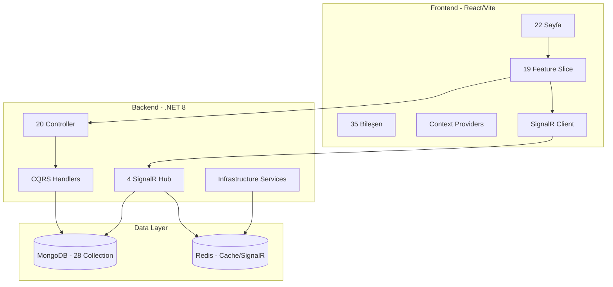

# NoobGg Kapsamlı Ürün ve Teknik Envanter Raporu

Bu rapor, NoobGg projesinde mevcut durumda neler yapıldığını, hangi sayfaların ne içerikler barındırdığını, hangi özelliklerin tam/kısmi/placeholder olduğunu ve teknik altyapıyı detaylı şekilde belgelemektedir.

---

## Bölüm 1: Yönetici Özeti

**Proje Amacı ve Hedef Kitle:**
NoobGg, oyuncuların birlikte oynayacak takım arkadaşları bulmasını, klanlar (guilds) kurmasını, yeteneklerine göre eşleşmesini (Elo sistemi) ve iletişim kurmasını sağlayan kapsamlı bir sosyal platformdur. Hedef kitle, rekabetçi veya eğlence amaçlı oyun oynayan ve kendine uygun oyuncu veya topluluk arayan tüm oyunculardır.

**Teknoloji Yığını Özeti:**
- **Frontend:** React 19, Vite 6, TypeScript, React Router 7, TanStack Query (veri yönetimi), Zustand (auth state), Tailwind CSS v4, Framer Motion (animasyonlar), Recharts (grafikler).
- **Backend:** .NET 8, ASP.NET Core REST API, SignalR (gerçek zamanlı iletişim), MediatR (CQRS mimarisi), FluentValidation.
- **Veritabanı ve Önbellek:** MongoDB (ana veritabanı), Redis (SignalR backplane ve önbellekleme).
- **Mimari:** Domain-Driven Design (DDD) prensiplerine dayalı katmanlı mimari (Domain, Application, Infrastructure, Api) ve Frontend'de Feature-Sliced Design.

**Mevcut Durum Değerlendirmesi:**
Proje, temel sosyal ve oyun bulma özelliklerinin (odalar, guild'ler, anlık mesajlaşma, bildirimler, profil yönetimi, elo sistemi) tamamına yakınını işlevsel olarak barındırmaktadır. Gerçek zamanlı altyapı (SignalR) başarıyla entegre edilmiştir. Moderasyon ve ödeme sistemleri gibi bazı yönetimsel/ticari özellikler kısmi veya placeholder durumundadır.

---

## Bölüm 2: Sayfa Bazlı Detaylı Envanter (23 Sayfa)

Uygulamadaki tüm sayfalar ve işlevleri aşağıda listelenmiştir. Yönlendirme (routing) `client/src/app/router.tsx` üzerinden yönetilmektedir.

| # | Sayfa | Route | Erişim Seviyesi | Sayfa Amacı ve İçeriği | Durum |
|---|-------|-------|-----------------|------------------------|-------|
| 1 | **Landing** | `/` | Public | Pazarlama ana sayfası. Özellik tanıtımları, istatistikler ve kayıt/odalara yönlendiren CTA'lar içerir. | Tam |
| 2 | **Login** | `/login` | Public | Kullanıcı girişi (Email/Kullanıcı adı + Şifre). | Tam |
| 3 | **Register** | `/register` | Public | Yeni hesap oluşturma. Şifre güç göstergesi içerir. | Tam |
| 4 | **Verify Email** | `/verify-email` | Public | 6 haneli OTP ile e-posta doğrulama ekranı. Yeniden gönderim süresi içerir. | Tam |
| 5 | **Onboarding** | `/onboarding` | Auth | Yeni kayıt olan kullanıcılar için profil tamamlama ve ilk oyun profillerini ekleme sihirbazı. | Tam |
| 6 | **Rooms List** | `/rooms` | Auth+Profile | Oyun odalarını listeleme, filtreleme, yeni oda oluşturma modalı ve önerilen odalar. | Tam |
| 7 | **Room Detail** | `/rooms/:roomId` | Auth+Profile | Oda detayları, üyeler, katılma/ayrılma/kapatma işlemleri, davetler ve oda içi gerçek zamanlı sohbet (ChatPanel). | Tam |
| 8 | **Guilds List** | `/guilds` | Auth+Profile | Klanları (Guilds) arama, filtreleme ve yeni klan oluşturma modalı. | Tam |
| 9 | **Guild Detail** | `/guilds/:guildId` | Auth+Profile | Klan ana sayfası, üyeler, roller, katılma/ayrılma ve davet işlemleri. | Tam |
| 10 | **Discover** | `/discover` | Auth+Profile | Oyunları ve oyuncuları keşfetme. Sekmeli yapı, zengin filtreler ve önerilen oyuncular. | Tam |
| 11 | **Compare** | `/compare` | Auth+Profile | İki oyuncuyu yan yana karşılaştırma (Elo, oyun profilleri, istatistik özeti). URL `?left=&right=` ile paylaşılabilir bağlantı; sayfa içi arama ile seçim. | Tam |
| 12 | **Leaderboard** | `/leaderboard` | Public | Oyuna göre Elo sıralamaları. Maç kaydetme modalı (RecordMatchModal) içerir. | Tam |
| 13 | **Game Detail** | `/games/:gameId` | Auth+Profile | Oyun detay sayfası. Platformlar, modlar, Metacritic tarzı istatistikler ve CTA'lar. | Tam |
| 14 | **Profile** | `/profile/:userId` | Auth+Profile | Kullanıcı tam profili. Elo geçmişi grafiği, oyun profilleri, engelleme/arkadaş ekleme/favoriye alma işlemleri. | Tam |
| 15 | **Edit Profile** | `/profile/edit` | Auth+Profile | Profil düzenleme (bio, ülke, avatar/banner yükleme, müsaitlik saatleri). | Tam |
| 16 | **Game Profiles** | `/profile/games` | Auth+Profile | Kullanıcının oynadığı oyunlara özel profillerini (rank, rol, bölge) ekleme/düzenleme/silme. | Tam |
| 17 | **Messages (DM)** | `/messages` | Auth+Profile | Direkt mesajlaşma. Sol tarafta konuşma listesi, sağ tarafta gerçek zamanlı sohbet ekranı. | Tam |
| 18 | **Friends** | `/friends` | Auth+Profile | Arkadaş listesi ve gelen/giden arkadaşlık istekleri yönetimi. | Tam |
| 19 | **Favorites** | `/favorites` | Auth+Profile | Favoriye (yer imi) alınan oyuncuların listesi. | Tam |
| 20 | **Notifications** | `/notifications` | Auth+Profile | Bildirim akışı, filtreleme, okundu işaretleme. Oda davetlerini kabul/reddetme. Son aktivite (Recent Activity) özeti. | Tam |
| 21 | **Settings** | `/settings` | Auth+Profile | Gizlilik, bildirim tercihleri, engellenenler listesi, hesap dondurma/silme işlemleri. | Tam |
| 22 | **Subscriptions** | `/subscriptions` | Public | Abonelik planları, fiyatlandırma, mevcut abonelik durumu ve iptal akışı. | Kısmi (Ödeme entegrasyonu yok) |
| 23 | **Moderation** | `/moderation` | Admin/Mod | Raporları inceleme ve moderasyon işlemleri paneli. | Placeholder |

---

## Bölüm 3: Özellik Bazlı Envanter

**3.1 Kimlik Doğrulama ve Yetkilendirme (Auth)**
- Kayıt olma (E-posta doğrulama OTP ile)
- Giriş yapma (JWT + Refresh Token)
- Oturum yönetimi (Zustand üzerinden)
- Rol tabanlı erişim (User, Moderator, Admin)

**3.2 Profil Sistemi**
- Genel kullanıcı profili (avatar, banner, bio, ülke)
- Oyun profilleri (oyun bazlı rank, rol, bölge, diller, iletişim tercihleri)
- Gizlilik ayarları (profil görünürlüğü vb.)
- Müşterek takvim (availability)

**3.3 Oda (Room) Sistemi**
- Oda oluşturma (oyun, bölge, dil, etiketler, max üye)
- Oda arama ve detaylı filtreleme
- Odaya katılma, ayrılma, odayı kapatma
- Odaya oyuncu davet etme
- Gerçek zamanlı oda sohbeti (SignalR ChatHub)
- Oda içi çevrimiçi durumu (Presence) ve yazıyor (Typing) göstergesi
- Mesaj silme/düzenleme
- Oturum sonuçları (Session Results) girme

**3.4 Guild (Klan) Sistemi**
- Klan oluşturma
- Klan arama ve filtreleme
- Klana katılma ve ayrılma
- Rol yönetimi (Owner, Officer, Member)
- Klan davetleri ve katılma talepleri (join requests) yönetimi

**3.5 Arkadaşlık Sistemi**
- Arkadaşlık isteği gönderme, kabul etme, reddetme
- Arkadaş listesi görüntüleme
- Arkadaşlıktan çıkarma

**3.6 Direkt Mesajlaşma (DM)**
- İki kişi arası konuşma başlatma
- Gerçek zamanlı mesaj gönderme/alma (SignalR DirectMessageHub)
- Okundu bildirimi (Read receipts)
- Yazıyor (Typing) göstergesi
- DM gizlilik ayarları (herkes, sadece arkadaşlar, kimse)

**3.7 Oyun Kataloğu**
- Oyun arama ve listeleme
- Oyun detayları (RAWG verileri ile uyumlu)
- Tür, platform ve çok oyunculu desteğine göre filtreleme

**3.8 Oyuncu Keşfi**
- Oyuncu arama ve filtreleme
- Önerilen oyuncular (oyun profili eşleşmesine göre)
- Önerilen odalar

**3.9 Elo / Sıralama Sistemi**
- 1v1 maç sonucu kaydetme
- Oyun bazlı liderlik tablosu
- Elo geçmişi grafiği (Recharts ile)
- Rank tier rozetleri (RankBadge)

**3.10 Bildirim Sistemi**
- Gerçek zamanlı bildirimler (SignalR NotificationHub)
- Bildirim tipleri (arkadaş isteği, oda daveti, klan daveti vb.)
- Okunmamış bildirim sayısı (badge)
- Tümünü okundu olarak işaretleme

**3.11 Engelleme Sistemi**
- Kullanıcı engelleme ve engel kaldırma
- Engelli kullanıcılar listesi
- Engellenen kişinin mesaj veya davet gönderememesi

**3.12 Favori Sistemi**
- Oyuncuyu favorilere (yer imlerine) ekleme/çıkarma
- Favori oyuncular listesi

**3.13 Raporlama ve Moderasyon**
- Kullanıcı veya içerik raporlama
- Rapor inceleme (Moderator/Admin için)
- Ban sistemi

**3.14 Abonelik Sistemi**
- Abonelik planlarını görüntüleme
- Mevcut abonelik durumu
- Abonelik iptali
- *(Not: Gerçek ödeme geçidi entegrasyonu henüz eklenmemiştir)*

**3.15 Son Aktivite (Recent Activity) - YENİ**
- Son etkileşime girilen oyuncular (DM, oda, arkadaşlık üzerinden)
- Son mesajlaşılan kişiler
- Son katılılan odalar
- Notifications sayfasında ana özet (Hub), Rooms ve Messages sayfalarında mini kartlar

**3.16 Hemen eşleştir (Quick Match)**
- `POST /api/matchmaking/queue` ile seçilen oyuna göre kuyruk (oyun profilinden bölge, birincil dil, Elo)
- Uygun başka bir arayan ile eşleşince otomatik “Quick Match” odası ve iki üye
- Engelli kullanıcılarla eşleşme yok; açık oda sahibi kısıtı ile uyumlu
- ~45 sn sonra `FallbackSuggested` + aynı oyuna göre önerilen oda linkleri (`Rooms` sayfası)
- `DELETE /api/matchmaking/queue`, `GET /api/matchmaking/queue/status`

---

## Bölüm 4: Backend API Envanteri

Backend, toplam **20 Controller** altında **94 HTTP Endpoint** sunmaktadır.

| Controller | Route Prefix | Endpoint Sayısı | Temel İşlevler |
|-----------|--------------|-----------------|----------------|
| `AuthController` | `/api/auth` | 7 | Kayıt, giriş, refresh token, logout, e-posta doğrulama. |
| `UsersController` | `/api/users` | 4 | Oyuncu keşfi, çevrimiçi durumu (presence), son aktivite. |
| `ProfilesController` | `/api/profiles` | 11 | Profil getirme/güncelleme, avatar/banner yükleme, oyun profilleri yönetimi. |
| `FriendsController` | `/api/friends` | 6 | Arkadaş listesi, istek gönderme/kabul/red, arkadaş silme. |
| `RoomsController` | `/api/rooms` | 11 | Oda oluşturma, listeleme, detay, katılma/ayrılma, davet işlemleri. |
| `MatchmakingController` | `/api/matchmaking` | 3 | Hemen eşleştir kuyruğu: gir/çık, durum sorgusu. |
| `GuildsController` | `/api/guilds` | 14 | Klan oluşturma, listeleme, katılma, rol yönetimi, davet ve başvuru işlemleri. |
| `GamesController` | `/api/games` | 3 | Oyun detayı, oyun arama ve listeleme. |
| `ChatController` | `/api/chat` | 1 | Oda sohbet geçmişini getirme. |
| `DirectMessagesController` | `/api/dm` | 5 | Konuşma listesi, mesaj geçmişi, mesaj gönderme, okundu işaretleme. |
| `EloController` | `/api/elo` | 4 | Maç kaydetme, liderlik tablosu, Elo geçmişi, oturum sonuçları. |
| `NotificationsController` | `/api/notifications` | 4 | Bildirim listesi, okunmamış sayısı, okundu işaretleme. |
| `SettingsController` | `/api/settings` | 6 | Ayarları getirme, gizlilik/bildirim güncelleme, hesap dondurma/silme. |
| `BlocksController` | `/api/blocks` | 3 | Engelleme, engel kaldırma, engelliler listesi. |
| `FavoritesController` | `/api/favorites` | 3 | Favori listesi, favoriye ekleme/çıkarma. |
| `RecommendationsController` | `/api/recommendations` | 2 | Önerilen oyuncular ve odalar. |
| `ReportsController` | `/api/reports` | 1 | Yeni rapor oluşturma. |
| `ModerationController` | `/api/moderation` | 3 | Rapor listesi, rapor detayı, rapor inceleme (Admin/Mod). |
| `SubscriptionsController` | `/api/subscriptions` | 4 | Plan listesi, mevcut abonelik, abonelik atama/iptal. |
| `HealthController` | `/api/Health` | 1 | API liveness/health check. |

---

## Bölüm 5: Gerçek Zamanlı Altyapı (SignalR)

Sistemde **4 adet SignalR Hub** bulunmaktadır. Çoklu sunucu ölçeklemesi için **Redis Backplane** yapılandırılmıştır.

| Hub | URL | İşlev |
|-----|-----|-------|
| **ChatHub** | `/hubs/chat` | Odalardaki sohbet mesajlarının iletimi, odaya katılma/ayrılma olayları, oda içi çevrimiçi durumu (Redis tabanlı presence) ve yazıyor (typing) göstergesi. |
| **DirectMessageHub** | `/hubs/dm` | Birebir (DM) mesaj iletimi, okundu bilgisi, yazıyor göstergesi ve genel çevrimiçi durumu (In-memory presence tracker). |
| **RoomHub** | `/hubs/room` | Genel oda listesindeki değişikliklerin (yeni oda, kapanan oda) anlık olarak tüm istemcilere duyurulması. |
| **NotificationHub** | `/hubs/notifications` | Kullanıcıya özel anlık bildirimlerin itilmesi ve okunmamış bildirim sayısının güncellenmesi. |

---

## Bölüm 6: Veritabanı Yapısı (MongoDB)

Sistemde toplam **28 Entity / Collection** bulunmaktadır.

1. **Kullanıcı ve Profil:** `users`, `userProfiles`, `userSettings`, `userGameProfiles`
2. **Oyunlar:** `games`
3. **Odalar (Rooms):** `rooms`, `roomMembers`, `roomInvites`, `messages`
4. **Klanlar (Guilds):** `guilds`, `guildMembers`, `guildInvites`, `guildJoinRequests`
5. **Sosyal:** `friendships`, `favorites`, `blocks`
6. **Mesajlaşma (DM):** `conversations`, `directMessages`
7. **Bildirimler:** `notifications`
8. **Abonelik:** `subscriptionPlans`, `userSubscriptions`
9. **Rekabet (Elo):** `matchResults`
10. **Sistem ve Güvenlik:** `reports`, `audits`, `refreshTokens`, `emailVerificationTokens`, `presences`
11. **Hemen eşleştir:** `matchQueueEntries`

---

## Bölüm 7: Frontend Bileşen Kütüphanesi

Frontend tarafında `client/src/components/` altında **35 adet** yeniden kullanılabilir bileşen bulunmaktadır. Bu bileşenler Tailwind CSS ve Framer Motion kullanılarak özel olarak geliştirilmiştir.

- **UI Primitives (`ui/` - 15 adet):** Button, Input, Select, Textarea, Modal, Badge, Spinner, Card (Header, Title, Content), Tabs, Toggle, ProgressBar, AnimatedPage, Toast.
- **Layout (`layout/` - 5 adet):** AppLayout, AuthLayout, Navbar, Sidebar, MobileNav.
- **Chat (`chat/` - 6 adet):** ChatPanel, ChatHeader, ChatInput, ChatMessages, ConnectionBanner.
- **Common (`common/` - 4 adet):** EmptyState, GameCard, ErrorBoundary, UserAvatar.
- **Elo & Ranking (`elo/` - 4 adet):** RecordMatchModal, SessionResultsModal, EloChart, RankBadge.
- **Activity (`activity/` - 3 adet):** RecentActivityHub, RecentJoinedRoomsMini, RecentMessagedMini.

---

## Bölüm 8: Eksik / Gelişim Alanları ve Teknik Borçlar

**Geliştirilmeye Açık Özellikler (Placeholder/Kısmi):**
- **Moderasyon Paneli:** Şu an sadece arayüz placeholder'ı mevcut. Raporların detaylı incelenip aksiyon alınabileceği bir yönetim paneli geliştirilmelidir.
- **Ödeme Entegrasyonu:** Abonelik planları listelenmektedir ancak Stripe/Iyzico gibi bir ödeme geçidi entegrasyonu eksiktir.
- **Klan Sohbeti:** Odalar için sohbet mevcutken, klanlara (guilds) özel kalıcı sohbet odaları eklenebilir.
- **Sesli/Görüntülü İletişim:** WebRTC entegrasyonu ile odalarda sesli iletişim sağlanabilir.
- **Mobil Uygulama:** Mevcut web arayüzü responsive olsa da, React Native veya benzeri bir teknoloji ile native mobil uygulama geliştirilebilir.

**Teknik Borçlar ve İyileştirmeler:**
- **Presence Tracker:** DM ve genel çevrimiçi durumunu tutan `InMemoryPresenceTracker`, tek sunuculu yapıda çalışmaktadır. Çoklu sunucu (scale-out) durumunda Redis tabanlı bir yapıya (ChatHub'da olduğu gibi) geçirilmelidir.
- **TypeScript Hataları:** Proje genelinde bazı sayfalarda (örn. `recordMatchModal.tsx`, `friends.tsx`) önceden kalma TypeScript lint/build uyarıları bulunmaktadır. Bunların temizlenmesi kod kalitesini artıracaktır.

---

## Veri Akışı Diyagramı

